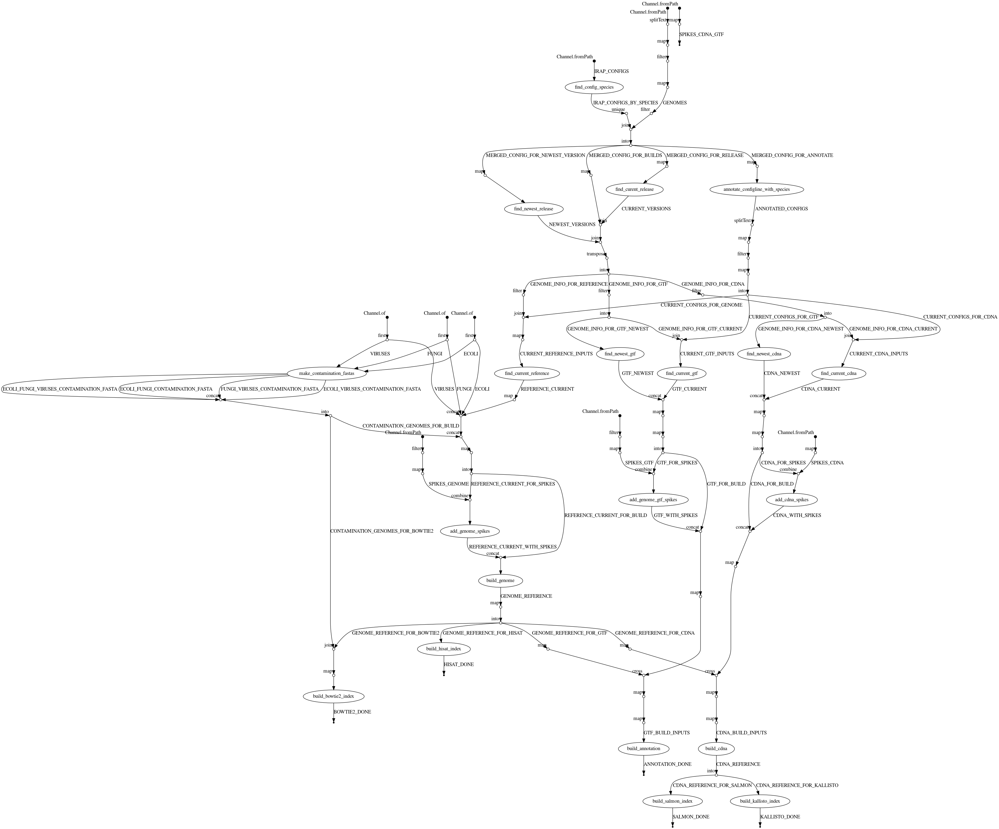

# Copy legacy ISL genome resources to Refgenie assets

This workflow is designed to copy all of the base genome resources used by the gene expression group to new Refgenie assets. 

## Prerequisites

 - Conda
 - Nextflow

## Usage

```
nextflow run isl_refs_to_refgenie/main.nf \
    --irapConfigDir=<path to directory with species-wise configuration files as used by IRAP> \
    --irapDataDir=<path to top level IRAP data directory, with 'references' subdirectory> \
    --refgenieDir=<path to refgenie top directory> \
    --islGenomes=<path togenome_references.conf>
```

## What's done



### Input file

Input files are discovered for each species:

 1. Current reference genome file from species configs
 2. Current cDNA reference file from species configs
 3. Current GTF annotation file from species configs
 4. Newest cDNA FASTA matching pattern in genome_references.conf
 5. Newest GTF matching pattern in genome references.com
 6. Bacterial, fungal and viral sequence files, to be used in contamination checks. 

### Building Refgenie assets

The plain base genome FASTA is used as the root asset for an assembly. All others (cDNAs, GTFs etc) are sub-assets of that. Genomes, transcriptomes and GTFs are also combined with spike-ins (currently just ERCC) and built/indexed under the same root asset.

### Genome indices

All genome resources are indexed by hisat2. Contamination indices are also indexed by Bowtie2.

#### Transcriptome indices

Each of the 4 transcriptome assets for each species (current and newest, with/without spikes) is indexed by both Kallisto and Salmon, with versions picked to match our single-cell pipelines.

## Result

Top-level resources are named like `species--assembly':

```
> refgenie list
                                                                 Local refgenie assets                                                                 
                                                  Server subscriptions: http://refgenomes.databio.org                                                  
┏━━━━━━━━━━━━━━━━━━━━━━━━━━━━━━━━━━━━━━━━━━━━━━━━━━━━━━━━━━━━━━━━━━━━━━━━━━━━━━━━━━━━━━━━━━━━━━━━━━┳━━━━━━━━━━━━━━━━━━━━━━━━━━━━━━━━━━━━━━━━━━━━━━━━━━━┓
┃ genome                                                                                           ┃ assets                                            ┃
┡━━━━━━━━━━━━━━━━━━━━━━━━━━━━━━━━━━━━━━━━━━━━━━━━━━━━━━━━━━━━━━━━━━━━━━━━━━━━━━━━━━━━━━━━━━━━━━━━━━╇━━━━━━━━━━━━━━━━━━━━━━━━━━━━━━━━━━━━━━━━━━━━━━━━━━━┩
│ escherichia_coli--str_k_12_substr_mg1655_ASM584v2                                                │ fasta, hisat2_index                               │
│ viruses--refseq_viral_2_1                                                                        │ fasta, hisat2_index                               │
│ fungi--refseq_fungi_53                                                                           │ fasta, hisat2_index                               │
│ escherichia_coli-viruses--str_k_12_substr_mg1655_ASM584v2-refseq_viral_2_1                       │ fasta, hisat2_index, bowtie2_index                │
│ escherichia_coli-fungi--str_k_12_substr_mg1655_ASM584v2-refseq_fungi_53                          │ fasta, hisat2_index, bowtie2_index                │
│ fungi-viruses--refseq_fungi_53-refseq_viral_2_1                                                  │ fasta, hisat2_index, bowtie2_index                │
│ escherichia_coli-fungi-viruses--str_k_12_substr_mg1655_ASM584v2-refseq_fungi_53-refseq_viral_2_1 │ fasta, hisat2_index, bowtie2_index                │
│ homo_sapiens--GRCh38                                                                             │ fasta, ensembl_gtf, salmon_index, kallisto_index  │
│                                                                                                  │ hisat2_index                                      │
└──────────────────────────────────────────────────────────────────────────────────────────────────┴───────────────────────────────────────────────────┘
                                                 use refgenie list -g <genome> for more detailed view                                                  
```

Child assets for an assembly are named to indicate their type (e.g. genome, cDNA) where that's not clear from the asset type, the associated genome resource (e.g. Ensembl) releases, with the spikes they contain (where applicable), and by the version of software used to generate them (where applicable, specifically indexes):

```
> refgenie list -g homo_sapiens--GRCh38
                                                                        Local refgenie assets                                                                         
                                                         Server subscriptions: http://refgenomes.databio.org                                                          
┏━━━━━━━━━━━━━━━━━━━━━━┳━━━━━━━━━━━━━━━━━━━━━━━━━━━━━━━━━━━━━━━━━━━━━━━━━━━━━━━━━━━━━━━━┳━━━━━━━━━━━━━━━━━━━━━━━━━━━━━━━━━━━━━━━━━━━━━━━━━━━━━━━━━━━━━━━━━━━━━━━━━━━━┓
┃ genome               ┃ asset (seek_keys)                                              ┃ tags                                                                       ┃
┡━━━━━━━━━━━━━━━━━━━━━━╇━━━━━━━━━━━━━━━━━━━━━━━━━━━━━━━━━━━━━━━━━━━━━━━━━━━━━━━━━━━━━━━━╇━━━━━━━━━━━━━━━━━━━━━━━━━━━━━━━━━━━━━━━━━━━━━━━━━━━━━━━━━━━━━━━━━━━━━━━━━━━━┩
│ homo_sapiens--GRCh38 │ fasta (fasta, fai, chrom_sizes, dir)                           │ genome, cdna_ensembl104, cdna_newest, cdna_ensembl95, cdna_current,        │
│                      │                                                                │ genome--spikes_ercc, cdna_ensembl95--spikes_ercc,                          │
│                      │                                                                │ cdna_current--spikes_ercc, cdna_ensembl104--spikes_ercc,                   │
│                      │                                                                │ cdna_newest--spikes_ercc                                                   │
│ homo_sapiens--GRCh38 │ ensembl_gtf (ensembl_gtf, ensembl_tss, ensembl_gene_body, dir) │ ensembl104, newest, ensembl95, current, ensembl95--spikes_ercc,            │
│                      │                                                                │ current--spikes_ercc, ensembl104--spikes_ercc, newest--spikes_ercc         │
│ homo_sapiens--GRCh38 │ salmon_index (salmon_index, dir)                               │ cdna_ensembl104--salmon_v1.2.0, cdna_ensembl95--salmon_v1.2.0,             │
│                      │                                                                │ cdna_ensembl95--spikes_ercc--salmon_v1.2.0, cdna_newest--salmon_v1.2.0,    │
│                      │                                                                │ cdna_ensembl104--spikes_ercc--salmon_v1.2.0, cdna_current--salmon_v1.2.0,  │
│                      │                                                                │ cdna_current--spikes_ercc--salmon_v1.2.0,                                  │
│                      │                                                                │ cdna_newest--spikes_ercc--salmon_v1.2.0                                    │
│ homo_sapiens--GRCh38 │ kallisto_index (kallisto_index, dir)                           │ ensembl95--kallisto_v0.45.0, ensembl104--kallisto_v0.45.0,                 │
│                      │                                                                │ ensembl95--spikes_ercc--kallisto_v0.45.0,                                  │
│                      │                                                                │ ensembl104--spikes_ercc--kallisto_v0.45.0, current--kallisto_v0.45.0,      │
│                      │                                                                │ current--spikes_ercc--kallisto_v0.45.0, newest--kallisto_v0.45.0,          │
│                      │                                                                │ newest--spikes_ercc--kallisto_v0.45.0                                      │
│ homo_sapiens--GRCh38 │ hisat2_index (hisat2_index, dir)                               │ genome--hisat2_v2.1.0, genome--spikes_ercc--hisat2_v2.1.0                  │
└──────────────────────┴────────────────────────────────────────────────────────────────┴────────────────────────────────────────────────────────────────────────────┘
```

